# Лабораторная работа №5: Автоматизация проверки кода с pre-commit

## Краткое описание pre-commit и его преимуществ

**pre-commit** – это инструмент для управления git-хуками, который автоматически проверяет качество кода перед каждым коммитом. Он позволяет настроить выполнение различных проверок (линтеры, форматтеры, проверка типов и т.д.) и гарантирует, что в репозиторий попадает только код, соответствующий заданным стандартам.

---

## Список использованных хуков и их назначение

| Хук | Репозиторий | Назначение |
|-----|-------------|------------|
| `trailing-whitespace` | pre-commit-hooks | Удаляет пробелы в конце строк |
| `end-of-file-fixer` | pre-commit-hooks | Добавляет пустую строку в конце файла |
| `check-yaml` | pre-commit-hooks | Проверяет синтаксис YAML файлов |
| `check-toml` | pre-commit-hooks | Проверяет синтаксис TOML файлов |
| `check-added-large-files` | pre-commit-hooks | Предотвращает добавление больших файлов (>500KB) |
| `validate-pyproject` | validate-pyproject | Валидирует pyproject.toml по стандартам PEP |
| `uv-lock` | uv-pre-commit | Проверяет синхронизацию uv.lock с pyproject.toml |
| `ruff-check` | ruff-pre-commit | Линтинг Python кода с автоматическим исправлением |
| `ruff-format` | ruff-pre-commit | Форматирование Python кода по стандартам PEP8 |
| `mypy-check` | local | Статическая проверка типов в Python коде |
| `commitizen` | local | Проверка сообщений коммитов на соответствие Conventional Commits |
| `no-print-statements` | local | Собственный хук – запрещает использование print() в коде |

---

## Скриншоты работы хуков

### 1. Работа базовых хуков (исправление пробелов и концов файлов)
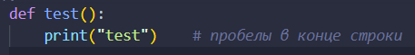
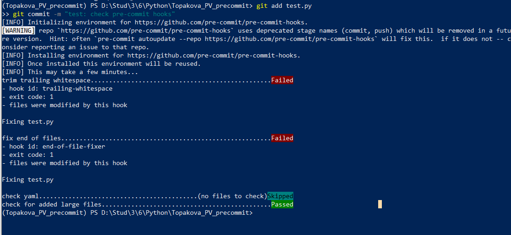
*Pre-commit автоматически удаляет пробелы в конце строк и добавляет пустую строку в конец файла*

### 2. Первый коммит с конфигурацией
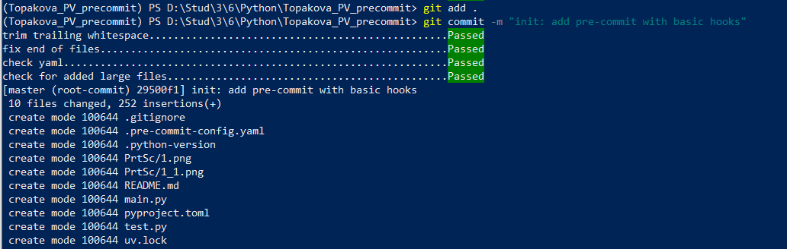
*Успешная инициализация проекта с базовыми хуками pre-commit*

### 3. Форматирование кода с ruff
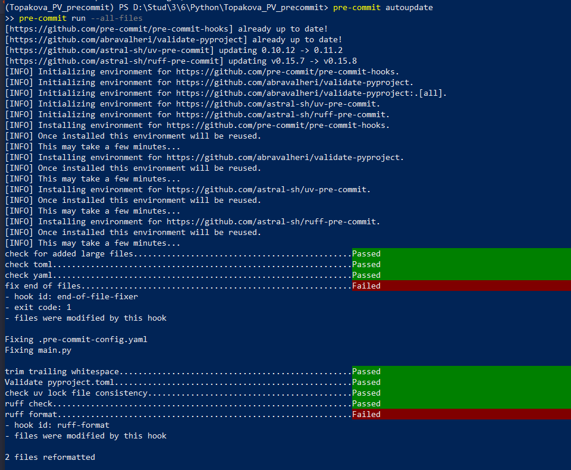
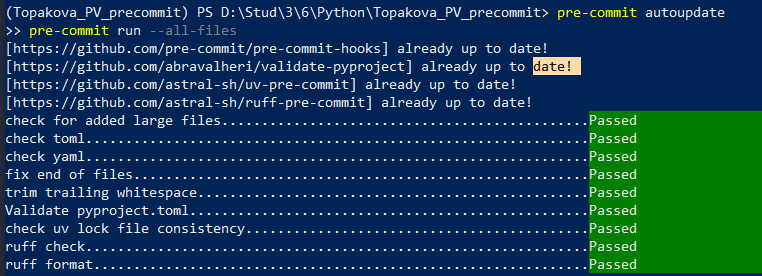
*Ruff автоматически исправляет отступы и форматирование кода*

### 4. Ошибка проверки типов (mypy)
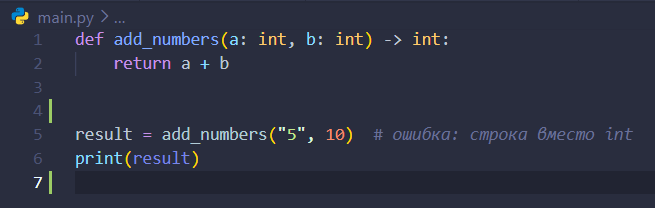
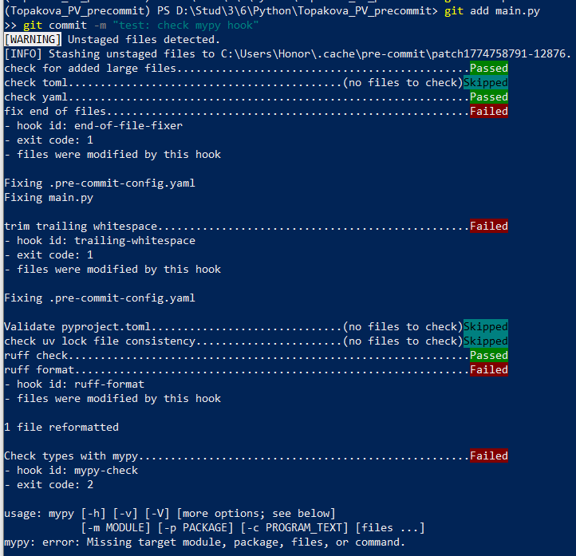
*Коммит отклонён – mypy обнаружил ошибку типов (передача строки вместо числа)*

### 5. Ошибка commitizen (неправильный формат сообщения)
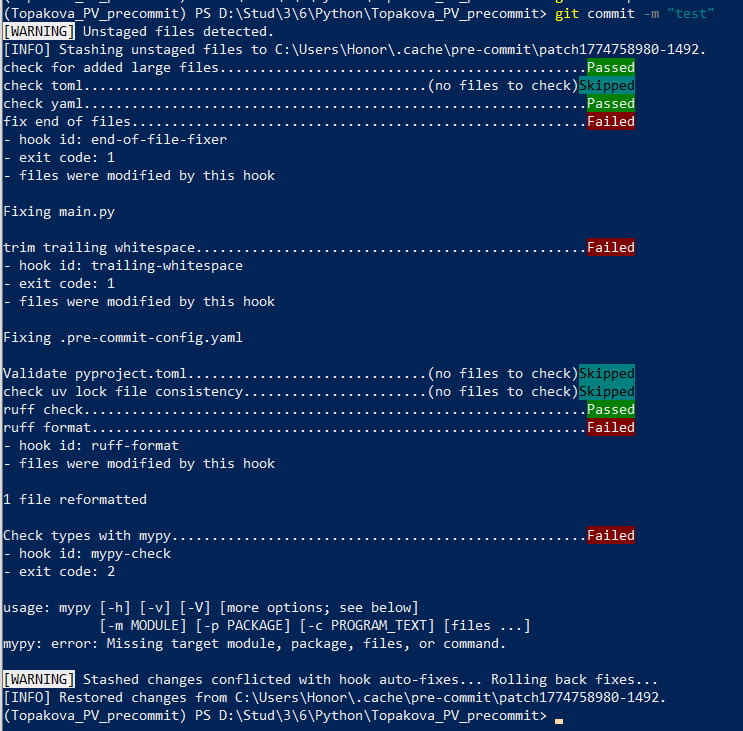
*Коммит отклонён – сообщение "test" не соответствует формату Conventional Commits*

### 6. Собственный хук (запрет на print)
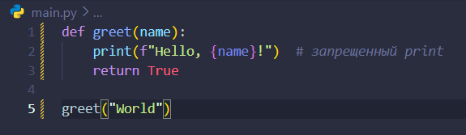
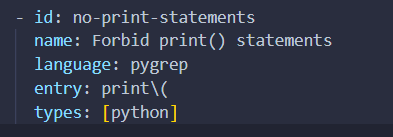
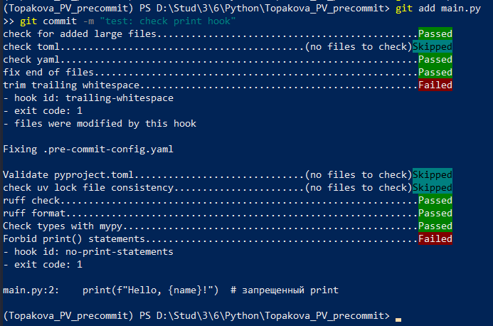
*Коммит отклонён – в коде обнаружен запрещённый print()*

## Инструкция по установке и использованию

### Для другого разработчика:

#### 1. Клонирование репозитория
git clone https://github.com/username/Topakova_PV_precommit.git
cd Topakova_PV_precommit
#### 2. Установка uv (если не установлен)
Windows:
powershell -c "irm https://astral.sh/uv/install.ps1 | iex"

macOS/Linux:
curl -LsSf https://astral.sh/uv/install.sh | sh
#### 3. Создание и активация виртуального окружения
uv venv

Windows:
.venv\Scripts\activate

macOS/Linux:
source .venv/bin/activate

#### 4. Установка зависимостей
uv sync

#### 5. Установка git-хуков
pre-commit install
pre-commit install --hook-type commit-msg
